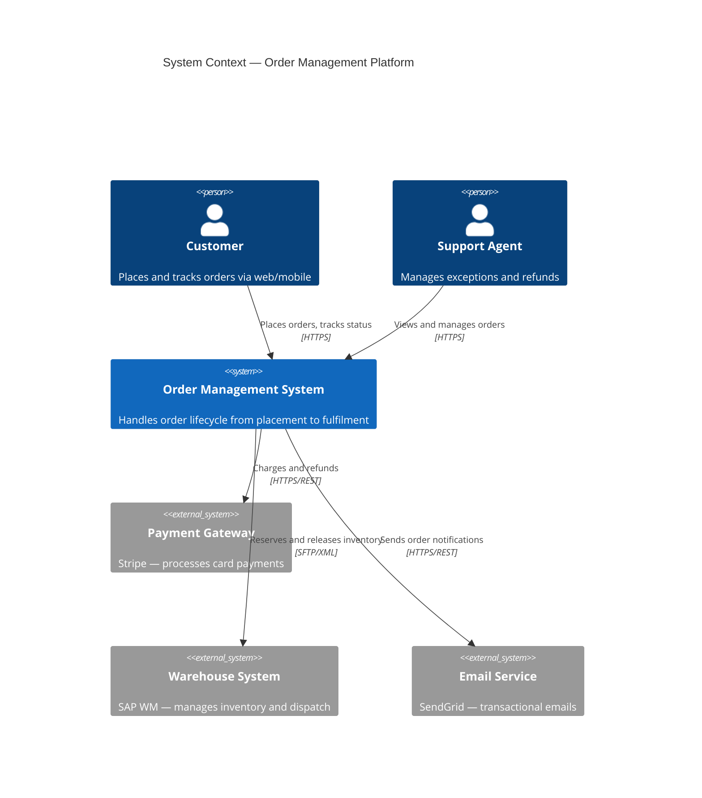
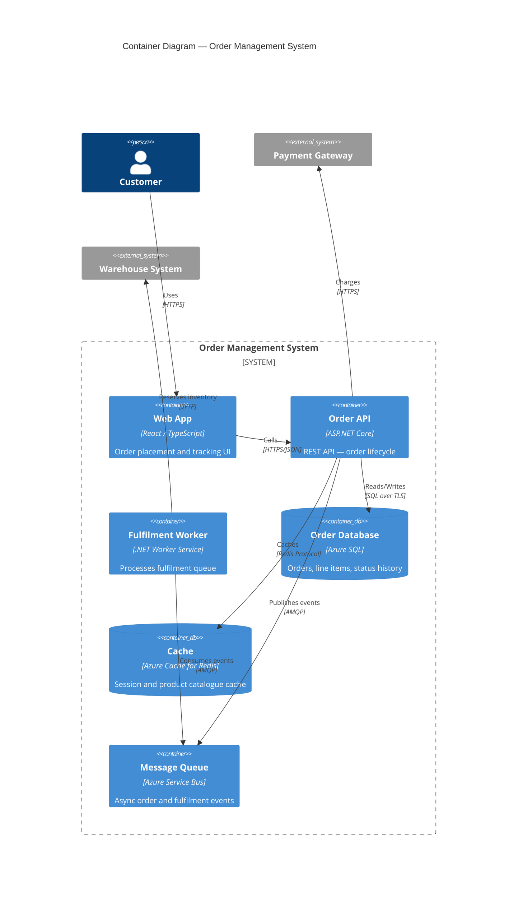
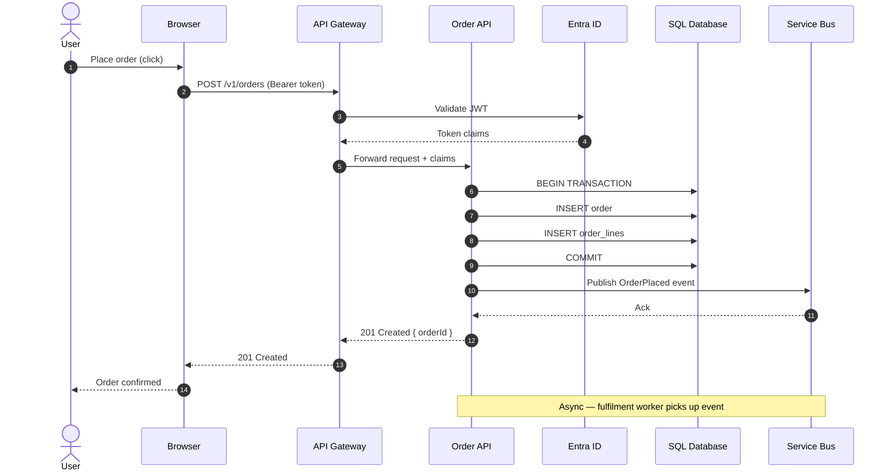
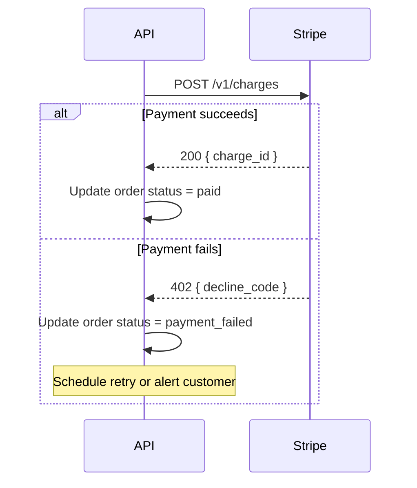
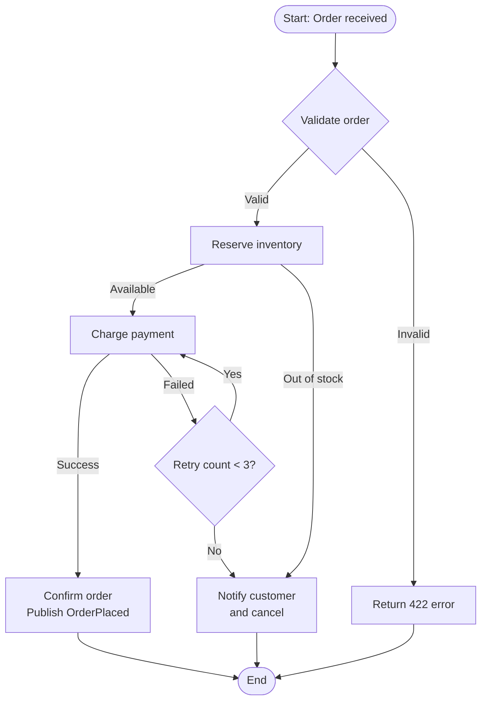
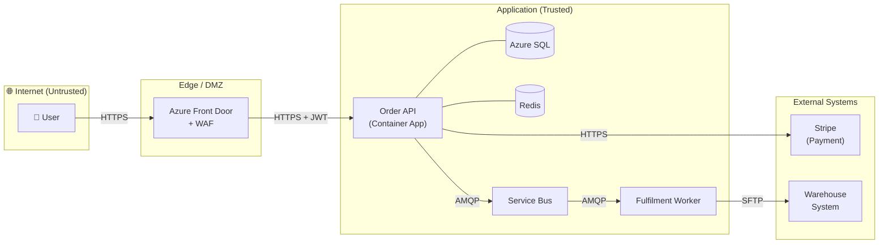
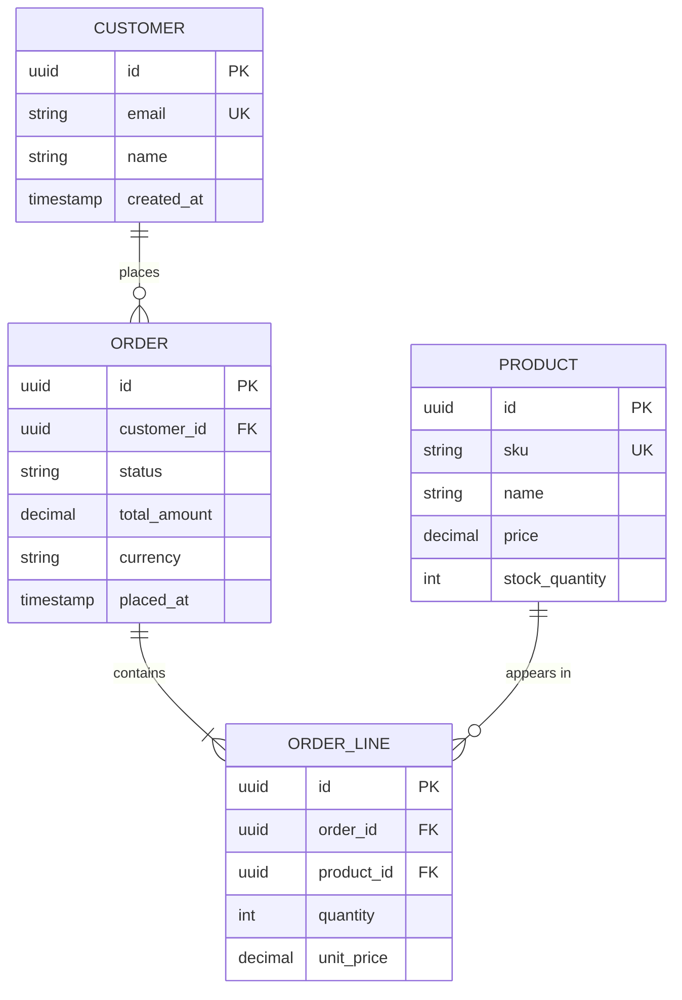
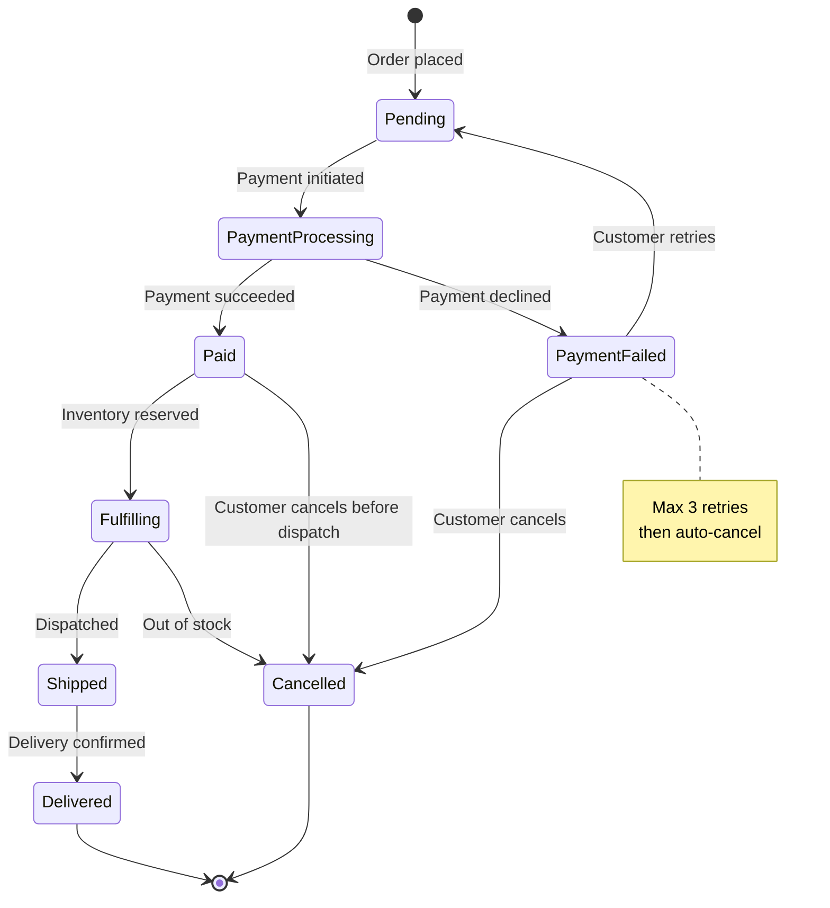
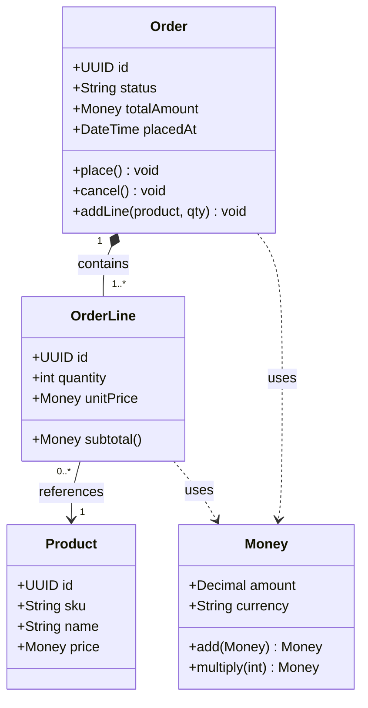
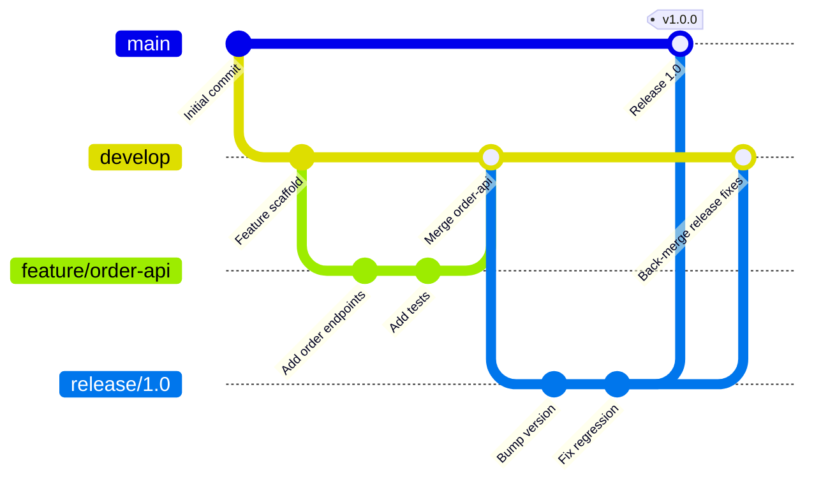

# Mermaid Diagrams

## Quick Rules

1. Always open with ` ```mermaid ` and close with ` ``` ` 
2. Use `%%` for comments, not `//` or `#`
3. Node IDs: alphanumeric + underscores only — no spaces, no special chars
4. Labels with special characters must be quoted: `A["Order (pending)"]`
5. Test diagrams with the Mermaid live editor: https://mermaid.live

---

## Diagram Type Selector

| Need | Diagram type | Keyword |
|------|-------------|---------|
| System-level context | C4 Context | `C4Context` |
| Services and their containers | C4 Container | `C4Container` |
| How components talk at runtime | Sequence | `sequenceDiagram` |
| Process or decision flow | Flowchart | `flowchart LR` / `flowchart TD` |
| Data flows with trust boundaries | Flowchart + subgraphs | `flowchart LR` |
| Database schema | Entity Relationship | `erDiagram` |
| State machine | State | `stateDiagram-v2` |
| Class hierarchy | Class | `classDiagram` |
| Timeline / milestones | Gantt | `gantt` |
| Git branching strategy | GitGraph | `gitGraph` |
| Deployment topology | Flowchart (with icons) | `flowchart TD` |

---

## C4 Diagrams

C4 = Context → Container → Component → Code. Draw as far in as needed.

### C4 Context (Level 1 — System in its environment)



### C4 Container (Level 2 — Technology choices inside the system)



---

## Sequence Diagrams

Best for: runtime behaviour, authentication flows, async event chains.



### Sequence diagram tips
- `autonumber` adds step numbers automatically
- Use `Note over A,B:` for cross-participant annotations
- Use `activate` / `deactivate` to show lifetimes
- `loop`, `alt`, `opt`, `par` for control flow



---

## Flowcharts

Best for: process flows, decision trees, data flows with trust boundaries.



### Trust boundary / data flow variant



### Flowchart node shapes

| Shape | Syntax | Use for |
|-------|--------|---------|
| Rectangle | `A[Text]` | Process, service |
| Rounded | `A(Text)` | Start/end terminal |
| Stadium | `A([Text])` | Start/end terminal (preferred) |
| Diamond | `A{Text}` | Decision |
| Parallelogram | `A[/Text/]` | Input/output |
| Cylinder | `A[(Text)]` | Database / data store |
| Subroutine | `A[[Text]]` | Subprocess call |
| Hexagon | `A{{Text}}` | Preparation |

---

## Entity Relationship Diagrams



### Cardinality syntax
| Symbol | Meaning |
|--------|---------|
| `\|\|` | Exactly one |
| `\|o` | Zero or one |
| `\|{` | One or more |
| `o{` | Zero or more |

---

## State Diagrams



---

## Class Diagrams



---

## GitGraph



---

## Common Mistakes

| Mistake | Fix |
|---------|-----|
| Spaces in node IDs | `order_api` not `order api` |
| Unquoted labels with brackets | `A["My (label)"]` |
| `->` instead of `-->` in sequence | Use `-->>` for response, `->>` for request |
| Missing `autonumber` in long sequences | Add `autonumber` at top |
| Overloaded flowchart (>15 nodes) | Split into two diagrams with a linking note |
| `C4Context` without `title` | Always add `title` |

---

## Architecture Diagram Conventions

| Element | Convention |
|---------|-----------|
| External systems | Grey background or `System_Ext` |
| Trust boundaries | Dashed border subgraph or `:::boundary` class |
| Databases | Cylinder shape `[(DB)]` |
| Message queues | Parallelogram or "Queue" label |
| Users/actors | `👤` emoji prefix or `Person()` in C4 |
| HTTPS flows | Label `"HTTPS"` on arrows |
| Async flows | Dashed arrow `-.->` in flowcharts |
| Synchronous RPC | Solid arrow `-->` |
