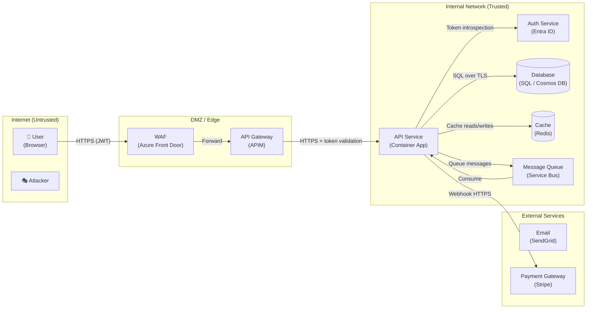

# Threat Modelling

## Overview

Threat modelling is a structured way to identify, classify, and mitigate security threats **before they are built in**. Run it alongside architecture design, not after.

**Four questions (Microsoft SDL approach):**
1. What are we building?
2. What can go wrong?
3. What are we going to do about it?
4. Did we do a good enough job?

---

## Step 1 — Scope and System Description

Capture before starting:

| Item | Detail |
|------|--------|
| **System boundary** | What is in scope? What is explicitly out of scope? |
| **Assets** | What does the system protect? (data, functionality, availability) |
| **Entry points** | All surfaces accessible to external actors |
| **Users/roles** | Actors with legitimate access |
| **Deployment context** | Cloud, on-premises, hybrid, public internet, VPN-only |
| **Compliance context** | GDPR, HIPAA, PCI-DSS, SOC2, ISO 27001 — affects residual risk tolerance |

---

## Step 2 — Draw the Data Flow Diagram (DFD)

Level 0 DFD (context diagram) first, then Level 1 (process decomposition).

### DFD Elements

| Symbol | Meaning | Notes |
|--------|---------|-------|
| Rectangle | **External entity** (actor, system, user) | Outside your control |
| Circle / rounded box | **Process** (transforms data) | Your code |
| Double line | **Data store** | Database, file, queue, cache |
| Arrow | **Data flow** | Label with data type and protocol |
| Dashed line | **Trust boundary** | Where security controls change |

### Trust Boundary Rules

Trust boundaries occur wherever:
- Data crosses from internet to internal network
- Authentication/authorisation state changes (anonymous → authenticated)
- Privilege level changes (user → admin, service → service)
- Data crosses organisational boundaries (your system → third party)

**Draw a trust boundary line. Every crossing is a threat candidate.**

### DFD Mermaid Template



---

## Step 3 — STRIDE Analysis

For **every data flow, process, and data store**, systematically consider each STRIDE category.

| Letter | Threat | Violated property | Key question |
|--------|--------|------------------|--------------|
| **S** | Spoofing | Authentication | Can an attacker pretend to be a legitimate user or service? |
| **T** | Tampering | Integrity | Can an attacker modify data in transit or at rest? |
| **R** | Repudiation | Non-repudiation | Can users deny performing actions? Can we prove they did? |
| **I** | Information Disclosure | Confidentiality | Can an attacker read data they shouldn't? |
| **D** | Denial of Service | Availability | Can an attacker make the system unavailable? |
| **E** | Elevation of Privilege | Authorisation | Can an attacker gain higher permissions than granted? |

### STRIDE per Element

| Element type | Most applicable threats |
|-------------|------------------------|
| External entity | S, R |
| Process | S, T, R, I, D, E |
| Data store | T, R, I, D |
| Data flow | T, I |
| Trust boundary crossing | S, T, I, E |

### STRIDE Threat Record Template

```
Threat ID    : T-001
Category     : Spoofing
Component    : API Gateway → Auth Service data flow
Description  : Attacker intercepts token exchange and replays stolen bearer token
               to impersonate a legitimate user session.
Attack vector: Network (man-in-the-middle on internal service communication)
Likelihood   : Medium (internal network, requires initial foothold)
Impact       : High (full user impersonation, data exfiltration)
DREAD Score  : 7/10
Mitigation   : M-001 — mTLS between gateway and auth service
               M-002 — Short-lived tokens (15 min max), token binding
               M-003 — Anomaly detection on token use patterns
Residual risk: Low (after mitigations)
Status       : Open / In progress / Mitigated
```

---

## Step 4 — DREAD Scoring

Use DREAD to prioritise which threats to address first.

| Factor | 1 (Low) | 5 (Medium) | 10 (High) |
|--------|---------|-----------|---------|
| **D**amage | Minimal impact | Some services affected | Total compromise / data breach |
| **R**eproducibility | Hard to reproduce | Reproducible with effort | Trivially reproducible |
| **E**xploitability | Expert attacker, special access | Skilled attacker | Unskilled, automated |
| **A**ffected users | 1 user | Many users | All users |
| **D**iscoverability | Hidden, obscure | Findable with investigation | Obvious, in the open |

**Score** = average of 5 factors. Prioritise: `score ≥ 7` high, `4–6` medium, `< 4` low.

---

## Step 5 — Mitigations

### STRIDE → Standard Mitigations

| Threat | Standard mitigations |
|--------|---------------------|
| **Spoofing** | Strong authentication (MFA, FIDO2), mutual TLS, certificate pinning, token validation |
| **Tampering** | HMAC signatures, TLS in transit, encryption at rest, input validation, parameterised queries |
| **Repudiation** | Tamper-evident audit logs, structured logging with actor ID, log shipping to immutable store |
| **Information Disclosure** | Encryption at rest + in transit, least-privilege data access, column-level encryption, PII masking in logs |
| **Denial of Service** | Rate limiting, request quotas, circuit breakers, auto-scaling, DDoS protection (Azure Front Door / DDoS Protection) |
| **Elevation of Privilege** | RBAC, attribute-based access control, principle of least privilege, network segmentation, managed identity (no passwords) |

### Mitigation Record Template

```
Mitigation ID : M-001
Addresses     : T-001, T-003
Control type  : Preventive
Description   : Enable mutual TLS (mTLS) between all internal services.
                Each service presents a client certificate signed by internal CA.
Implementation: Dapr sidecar mTLS / Azure Container Apps mTLS policy
Verification  : Certificate validity confirmed in API traces; rejected connections logged
Owner         : Platform team
Status        : Planned / Implemented / Verified
```

### Control Types

| Type | Description | Example |
|------|-------------|---------|
| **Preventive** | Stops the threat occurring | Input validation, mTLS |
| **Detective** | Detects the threat when it occurs | SIEM alert, anomaly detection |
| **Corrective** | Reduces impact after exploitation | Incident response plan, automated rollback |
| **Deterrent** | Discourages attackers | Legal notices, visible monitoring |

---

## Step 6 — Residual Risk Assessment

After all mitigations are applied, document what risk remains.

| Risk level | Definition | Action |
|------------|-----------|--------|
| **Accepted** | Likelihood + impact within tolerance | Document acceptance, owner named |
| **Transferred** | Covered by insurance or third party | Reference contract/policy |
| **Avoided** | Feature/component removed | Document decision as ADR |
| **Mitigated further** | Residual still too high | Return to Step 5 |

---

## Threat Model Output Document

```markdown
# Threat Model: [System Name]

**Date:** YYYY-MM-DD  
**Authors:** [names]  
**Scope:** [what's in/out of scope]  
**Version:** 1.0

## System Description
[Brief description, deployment context, key assets]

## Data Flow Diagram
[Mermaid DFD — see template above]

## Trust Boundaries
[List each boundary and what crosses it]

## Threat Register

| ID | STRIDE | Component | Description | DREAD | Mitigation IDs | Status |
|----|--------|-----------|-------------|-------|----------------|--------|
| T-001 | S | ... | ... | 7 | M-001, M-002 | Open |

## Mitigation Register

| ID | Addresses | Type | Description | Owner | Status |
|----|-----------|------|-------------|-------|--------|
| M-001 | T-001 | Preventive | ... | ... | Planned |

## Residual Risk Summary

| Threat ID | Residual Level | Disposition |
|-----------|---------------|-------------|
| T-001 | Low | Accepted |

## Open Issues
[Anything requiring further analysis or decisions]
```

---

## Common High-Value Threats (check these first)

| Threat | Where to look |
|--------|--------------|
| Broken authentication | Every external entry point and service-to-service call |
| Insecure direct object reference | Every GET/PUT/DELETE with a resource ID |
| Mass assignment | Every POST/PATCH that accepts a request body |
| SSRF (Server-Side Request Forgery) | Anywhere the service fetches a URL from user input |
| SQL/NoSQL injection | Every database query that incorporates user input |
| Secrets in transit/logs | All external API calls, all log statements |
| Overly-permissive CORS | All browser-facing APIs |
| Stale tokens / missing revocation | All OAuth2/OIDC implementations |
| Third-party dependency compromise | All npm/pip/nuget packages, container base images |

---

## Integration with Architecture Reviews

Run threat modelling **after** producing the Level 1 DFD in the architecture review:

1. Architecture review produces component diagram → convert to DFD
2. STRIDE analysis on every trust boundary crossing
3. Mitigations fed back into architecture constraints
4. Significant mitigations documented as ADRs (invoke `adr-writing` skill)
5. Residual risks logged in `docs/architecture/risks.md`
